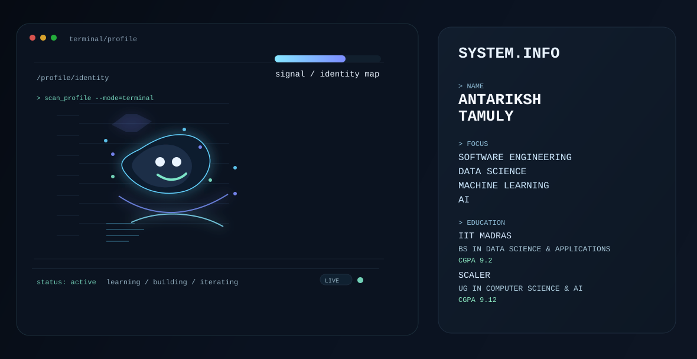

  <picture>
    <source media="(prefers-color-scheme: dark)" srcset="./dark.svg">
    <source media="(prefers-color-scheme: light)" srcset="./light.svg">
    
  </picture>

<h1 align="center">Antariksh Tamuly</h1>

  <strong>Software Engineering · Data Science · Machine Learning · AI</strong>

  <a href="https://github.com/ANTARIKSH2007TAMULY">GitHub</a> ·
  <a href="https://www.linkedin.com/in/antariksh-tamuly-5307ab373/">LinkedIn</a> ·
  <a href="https://antariksh-portfolio-tau.vercel.app/">Portfolio</a>

  

## 01 / IDENTITY

I am Antariksh Tamuly, a student and early-career developer building a strong technical foundation across software engineering, data science, machine learning, and AI. My academic path includes IIT Madras, where I am pursuing a BS in Data Science and Applications, and Scaler School of Technology, where I am pursuing a UG in Computer Science & AI.

I focus on building dependable software, working with data-driven systems, and exploring practical machine learning and AI workflows. The aim is to keep growing technical depth while staying grounded in strong engineering fundamentals and real-world implementation.

## 02 / SYSTEM STATE

  <svg width="1180" height="220" viewBox="0 0 1180 220" fill="none" xmlns="http://www.w3.org/2000/svg" role="img" aria-label="System state dashboard">
    <defs>
      <linearGradient id="signalPanel" x1="0" y1="0" x2="1" y2="1">
        <stop offset="0" stop-color="#0A1220"/>
        <stop offset="1" stop-color="#0E1A2C"/>
      </linearGradient>
      <linearGradient id="signalLine" x1="0" y1="0" x2="1" y2="0">
        <stop offset="0" stop-color="#7DE5FF"/>
        <stop offset="0.5" stop-color="#7588FF"/>
        <stop offset="1" stop-color="#7DE5FF"/>
      </linearGradient>
    </defs>
    <rect width="1180" height="220" rx="18" fill="url(#signalPanel)" stroke="#1D3552"/>
    <path d="M0 68H1180" stroke="#1E3550"/>
    <path d="M0 135H1180" stroke="#1E3550" opacity="0.7"/>
    <path d="M0 180H1180" stroke="#1E3550" opacity="0.7"/>
    <g>
      <text x="54" y="52" fill="#9CB6D0" font-size="11" font-family="ui-monospace, SFMono-Regular, Menlo, Monaco, Consolas, Liberation Mono, monospace">SYSTEM STATE</text>
      <text x="54" y="96" fill="#EAF9FF" font-size="28" font-weight="700" font-family="ui-monospace, SFMono-Regular, Menlo, Monaco, Consolas, Liberation Mono, monospace">ONLINE</text>
      <text x="54" y="122" fill="#7DE5C8" font-size="12" font-family="ui-monospace, SFMono-Regular, Menlo, Monaco, Consolas, Liberation Mono, monospace">ACTIVE</text>
    </g>
    <g>
      <path d="M420 88C470 54 535 48 597 75C654 100 706 101 760 83C821 62 900 62 988 87" stroke="url(#signalLine)" stroke-width="3" fill="none" stroke-linecap="round">
        <animate attributeName="stroke-dasharray" values="0 1200; 700 500; 0 1200" dur="7s" repeatCount="indefinite"/>
      </path>
      <circle cx="420" cy="88" r="5" fill="#7DE5FF">
        <animate attributeName="opacity" values="0.3;1;0.3;1;0.3" dur="2.7s" repeatCount="indefinite"/>
      </circle>
      <circle cx="597" cy="75" r="5" fill="#7D88FF">
        <animate attributeName="opacity" values="0.5;1;0.5;1;0.5" dur="3.2s" repeatCount="indefinite"/>
      </circle>
      <circle cx="760" cy="83" r="5" fill="#7DE5FF">
        <animate attributeName="opacity" values="0.4;1;0.4;1;0.4" dur="2.8s" repeatCount="indefinite"/>
      </circle>
    </g>
    <g fill="#A9C5D8" font-size="12" font-family="ui-monospace, SFMono-Regular, Menlo, Monaco, Consolas, Liberation Mono, monospace">
      <text x="440" y="54">SOFTWARE</text>
      <text x="602" y="54">DATA</text>
      <text x="765" y="54">ML</text>
      <text x="934" y="54">AI</text>
    </g>
    <g opacity="0.9">
      <circle cx="1030" cy="100" r="4" fill="#7DE5FF"/>
      <circle cx="1088" cy="124" r="4" fill="#7D88FF"/>
      <circle cx="980" cy="150" r="4" fill="#7DE5FF"/>
      <path d="M1030 100L1088 124L980 150" stroke="#1E3550" stroke-width="1.2"/>
    </g>
  </svg>

## 03 / BUILDING

- Full-stack software systems with an emphasis on maintainability, clarity, and reliable architecture
- Data-driven applications that turn raw information into useful, actionable insight
- Machine learning and AI experiments grounded in practical use cases and thoughtful iteration
- A disciplined blend of software engineering fundamentals and applied data/ML thinking

## 04 / STACK

| Area | Focus |
| --- | --- |
| Languages | Python, JavaScript, TypeScript, SQL, C++, Java, HTML, CSS |
| Data / ML | Pandas, NumPy, scikit-learn, exploratory data analysis, model experimentation |
| Frontend | HTML, CSS, JavaScript, React, responsive UI design |
| Backend | REST APIs, server-side logic, database integration, application architecture |
| Databases | SQL, relational data modeling, persistent application data |
| Tools | Git, GitHub, VS Code, Linux, debugging, testing workflows |
| Cloud / DevOps | GitHub Actions, deployment workflows, environment management |

## 05 / EDUCATION

  <svg width="1180" height="220" viewBox="0 0 1180 220" fill="none" xmlns="http://www.w3.org/2000/svg" role="img" aria-label="Education timeline">
    <defs>
      <linearGradient id="eduLine" x1="0" y1="0" x2="1" y2="0">
        <stop offset="0" stop-color="#7DE5FF"/>
        <stop offset="1" stop-color="#7A8BFF"/>
      </linearGradient>
    </defs>
    <rect width="1180" height="220" rx="20" fill="#0A1220" stroke="#1E3550"/>
    <path d="M170 110H1040" stroke="#1E3550" stroke-width="2"/>
    <path d="M170 110H450" stroke="url(#eduLine)" stroke-width="4" stroke-linecap="round">
      <animate attributeName="stroke-dasharray" values="0 1000; 500 500; 0 1000" dur="5s" repeatCount="indefinite"/>
    </path>
    <g>
      <circle cx="170" cy="110" r="8" fill="#7DE5FF"><animate attributeName="opacity" values="0.5;1;0.5;1;0.5" dur="3s" repeatCount="indefinite"/></circle>
      <circle cx="520" cy="110" r="8" fill="#7A8BFF"><animate attributeName="opacity" values="0.5;1;0.5;1;0.5" dur="2.8s" repeatCount="indefinite"/></circle>
      <circle cx="870" cy="110" r="8" fill="#7DE5FF"><animate attributeName="opacity" values="0.5;1;0.5;1;0.5" dur="3.2s" repeatCount="indefinite"/></circle>
      <circle cx="1040" cy="110" r="8" fill="#7A8BFF"><animate attributeName="opacity" values="0.5;1;0.5;1;0.5" dur="2.5s" repeatCount="indefinite"/></circle>
    </g>
    <g fill="#EAF6FF" font-family="ui-monospace, SFMono-Regular, Menlo, Monaco, Consolas, Liberation Mono, monospace">
      <text x="120" y="60" font-size="12">IIT MADRAS</text>
      <text x="120" y="84" font-size="18" font-weight="700">BS DATA SCIENCE &amp; APPLICATIONS</text>
      <text x="120" y="156" font-size="20" font-weight="700">CGPA 9.2</text>
      <text x="450" y="60" font-size="12">SCALER SCHOOL OF TECHNOLOGY</text>
      <text x="450" y="84" font-size="18" font-weight="700">UG COMPUTER SCIENCE &amp; AI</text>
      <text x="450" y="156" font-size="20" font-weight="700">CGPA 9.12</text>
    </g>
  </svg>

## 06 / ACTIVITY

The contribution graph below is generated from GitHub Actions and refreshed automatically.

  

## 07 / CONNECT

  <svg width="1180" height="200" viewBox="0 0 1180 200" fill="none" xmlns="http://www.w3.org/2000/svg" role="img" aria-label="Terminal connect panel">
    <defs>
      <linearGradient id="termGrad" x1="0" y1="0" x2="1" y2="0">
        <stop offset="0" stop-color="#7DE5FF"/>
        <stop offset="1" stop-color="#7A8BFF"/>
      </linearGradient>
    </defs>
    <rect width="1180" height="200" rx="18" fill="#0A1220" stroke="#1E3550"/>
    <g opacity="0.85">
      <circle cx="50" cy="32" r="6" fill="#FF5F57"/>
      <circle cx="72" cy="32" r="6" fill="#FEBC2E"/>
      <circle cx="94" cy="32" r="6" fill="#28C840"/>
    </g>
    <text x="54" y="76" fill="#9AB9CF" font-size="12" font-family="ui-monospace, SFMono-Regular, Menlo, Monaco, Consolas, Liberation Mono, monospace">$ connect --with antariksh</text>
    <text x="54" y="116" fill="#DDF6FF" font-size="18" font-family="ui-monospace, SFMono-Regular, Menlo, Monaco, Consolas, Liberation Mono, monospace">loading github...</text>
    <text x="54" y="148" fill="#DDF6FF" font-size="18" font-family="ui-monospace, SFMono-Regular, Menlo, Monaco, Consolas, Liberation Mono, monospace">loading linkedin...</text>
    <text x="54" y="180" fill="#DDF6FF" font-size="18" font-family="ui-monospace, SFMono-Regular, Menlo, Monaco, Consolas, Liberation Mono, monospace">loading portfolio...</text>
    <g font-family="ui-monospace, SFMono-Regular, Menlo, Monaco, Consolas, Liberation Mono, monospace" fill="#DDF6FF">
      <text x="710" y="76" font-size="12" fill="#7DE5C8">GITHUB</text>
      <text x="710" y="103" font-size="15"><a href="https://github.com/ANTARIKSH2007TAMULY" style="fill:#DDF6FF; text-decoration:none;">ANTARIKSH2007TAMULY</a></text>
      <text x="710" y="136" font-size="12" fill="#7DE5C8">LINKEDIN</text>
      <text x="710" y="163" font-size="15"><a href="https://www.linkedin.com/in/antariksh-tamuly-5307ab373/" style="fill:#DDF6FF; text-decoration:none;">antariksh-tamuly-5307ab373</a></text>
    </g>
    <path d="M980 118H1100" stroke="url(#termGrad)" stroke-width="3" stroke-linecap="round">
      <animate attributeName="stroke-dasharray" values="0 200; 150 50; 0 200" dur="4s" repeatCount="indefinite"/>
    </path>
  </svg>

---

  <i>Building software, data, and intelligence with a strong technical foundation.</i>

